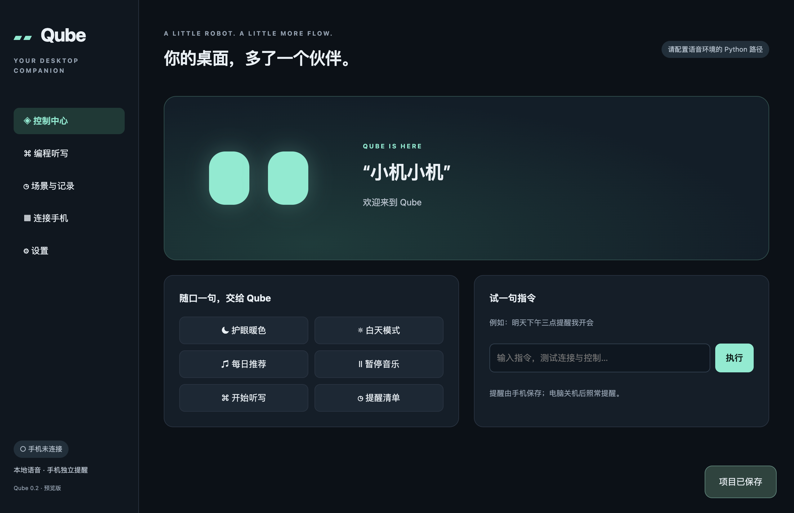

# Qube

[](https://github.com/quehengrong/Qube/actions/workflows/build.yml)

把 Redmi 变成有表情的桌面语音伙伴：喊“小机小机”，控制 Windows、向 Codex / Claude CLI 听写，或创建电脑关机后仍会提醒的备忘。



## 安装预览版

从 [GitHub Actions 构建记录](https://github.com/quehengrong/Qube/actions/workflows/build.yml) 的成功运行中下载：

- [**Qube-Windows-x64-preview**](https://github.com/quehengrong/Qube/actions/runs/37582686424/artifacts/11465751249)：Windows 11 安装程序。
- [**Qube-Android-arm64-preview**](https://github.com/quehengrong/Qube/actions/runs/37582686424/artifacts/11464924568)：Redmi 可安装的 debug 签名 APK。

按 [安装与使用说明](docs/setup.md) 配置本地语音环境、手机权限和扫码配对。模型下载需要联网；正常语音处理在本地完成。实际 Redmi / Windows 软件版本仍需完成 [设备验收](docs/validation.md)。

## 第一版包含

- 本地机械眼睛动画、中文唤醒词、收音及中文离线播报。
- 加密局域网配对，证书指纹固定、令牌鉴权及断线重连。
- WSL / PowerShell 托管 Codex 和 Claude 会话；先编辑草稿，再确认发送。
- 软件启动、网易云控件适配、Windows 护眼暖色开关。具体控件需匹配安装版本，不支持时明确报错。
- 手机本地提醒清单、提前提醒、单次／每天／每周重复、通知操作和重启恢复。

手机：REDMI 15R 5G / HyperOS 2；电脑：Windows 11，推荐使用用户现有 RTX 4070 Ti 承担识别。电脑离线时，手机保留动画与提醒，并可手动新增提醒。

## 开发

Node.js 22 LTS、npm；Android 需要 JDK 17、SDK 35 和 Gradle 8.11.1；语音服务需要 Python 3.10–3.12（安装脚本使用 3.11）。

```sh
npm ci
npm run build -w @qube/protocol
npm run check
npm test
npm run build
npm run dev
```

```text
apps/android        Kotlin / Compose 手机应用
apps/windows        Electron 桌面与 C# Windows 控件适配
services/speech     本地 faster-whisper HTTP 服务
packages/protocol   消息校验、提醒时间解析、草稿状态管理
scripts             构建资源准备
docs                安装、协议与验收记录
```

详见 [构建步骤](docs/setup.md#从源码构建)、[通信协议](docs/protocol.md)、[第三方组件](docs/third-party.md)。不要提交模型、录音、个人提醒数据或凭据。每笔代码提交都推送到本仓库；安装包由 CI 作为构建产物提供。
